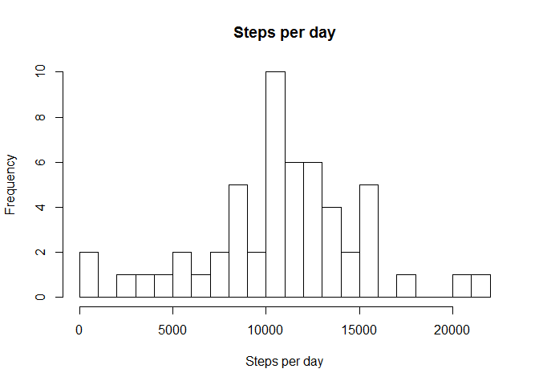
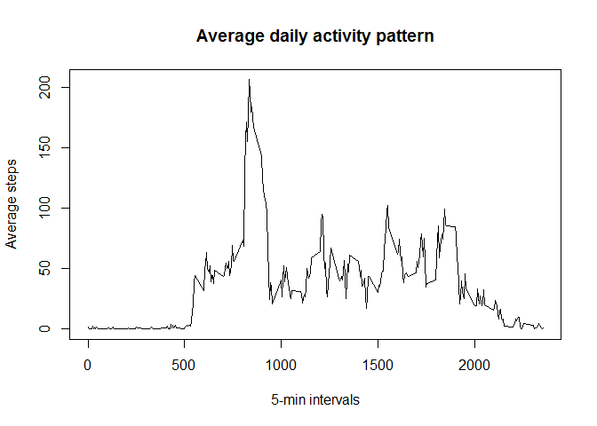
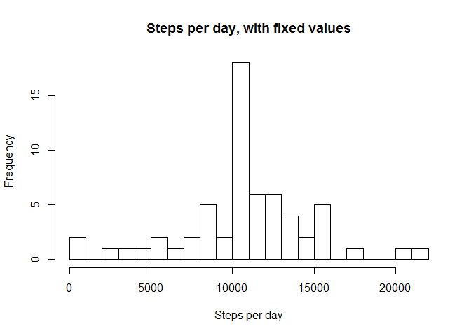
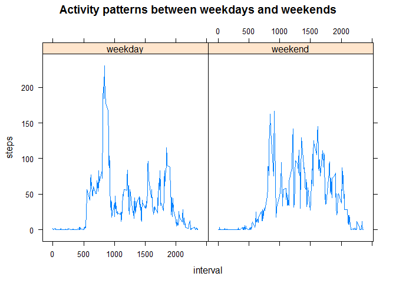

# Reproducible Research: Peer Assessment 1


## Loading and preprocessing the data


```r
unzip("activity.zip")
df <- read.csv("activity.csv")
file.remove("activity.csv")
```

```
## [1] TRUE
```

```r
head(df)
```

```
##   steps       date interval
## 1    NA 2012-10-01        0
## 2    NA 2012-10-01        5
## 3    NA 2012-10-01       10
## 4    NA 2012-10-01       15
## 5    NA 2012-10-01       20
## 6    NA 2012-10-01       25
```

```r
summary(df)
```

```
##      steps                date          interval     
##  Min.   :  0.00   2012-10-01:  288   Min.   :   0.0  
##  1st Qu.:  0.00   2012-10-02:  288   1st Qu.: 588.8  
##  Median :  0.00   2012-10-03:  288   Median :1177.5  
##  Mean   : 37.38   2012-10-04:  288   Mean   :1177.5  
##  3rd Qu.: 12.00   2012-10-05:  288   3rd Qu.:1766.2  
##  Max.   :806.00   2012-10-06:  288   Max.   :2355.0  
##  NA's   :2304     (Other)   :15840
```

## What is mean total number of steps taken per day?


```r
steps_per_day_df <- aggregate(steps~date, data=df, FUN=sum)
steps <- steps_per_day_df$steps
hist(steps,breaks=20, main="Steps per day", xlab="Steps per day")
```

 

```r
mean_steps_per_day <- mean(steps)
median_steps_per_day <- median(steps)
```
Mean total number of steps taken per day -  10766.189  
Median total number of steps taken per day - 10765

## What is the average daily activity pattern?


```r
average_steps_per_interval_df <- aggregate(steps~interval, data=df, FUN=mean)
plot(average_steps_per_interval_df, type="l", main="Average daily activity pattern",xlab="5-min intervals", ylab="Average steps")
```

 

```r
max_index <- which.max(average_steps_per_interval_df$steps)
max_interval <- average_steps_per_interval_df[max_index, "interval"]
```

The 5-minute interval, on average across all days, that contains the maximum number of steps is 835

## Imputing missing values


```r
na_count <- sum(is.na(df$steps))
```

Total number of missing values in the dataset is 2304

Filling in all of the missing values in the dataset by the mean for that 5-minute interval:


```r
missing_rows <- subset(df, is.na(steps))[-1]
filled_rows <-merge(missing_rows, average_steps_per_interval_df, by = "interval")
df <- rbind(filled_rows, subset(df, !is.na(steps)))

# as in Part1
steps_per_day_df <- aggregate(steps~date, data=df, FUN=sum)
steps <- steps_per_day_df$steps
hist(steps,breaks=20, main="Steps per day, with fixed values", xlab="Steps per day")
```

 

```r
mean_steps_per_day_fixed <- mean(steps)
median_steps_per_day_fixed <- median(steps)

missed_days_count <- length(unique(missing_rows$date))
```

Mean total number of steps taken per day when fixed -  10766.189  
Median total number of steps taken per day when fixed - 10766.189

Because we fill missing values with average across all times, mean is not change, and median is closer to mean. Plot have bigger peak in center, all days, that was missing, now filled with average day values, so peak increase by 8 missed days

## Are there differences in activity patterns between weekdays and weekends?


```r
Sys.setlocale("LC_TIME", "C");
```

```
## [1] "C"
```

```r
df$date <- as.Date(df$date)
weekinfo <- factor(ifelse(weekdays(df$date) %in% c("Saturday", "Sunday"),"weekend", "weekday"))
df <- cbind(df, weekinfo)

library(lattice)
steps_per_day_df <- aggregate(steps ~ interval + weekinfo, data = df, FUN = mean)
xyplot(steps ~ interval | weekinfo, data = steps_per_day_df, type = "l", main="Activity patterns between weekdays and weekends")
```

 

Btw, initial data set is not enough to say, weekend or weekday is it. In different countries week ends in different days, follow https://en.wikipedia.org/wiki/Workweek_and_weekend to details
